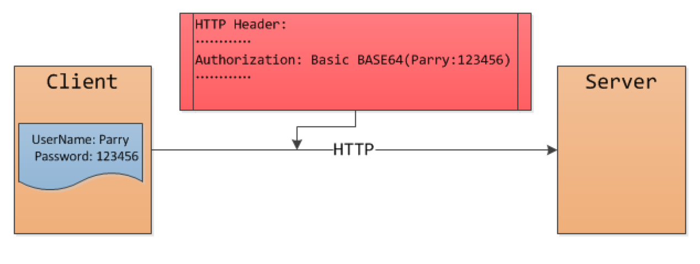
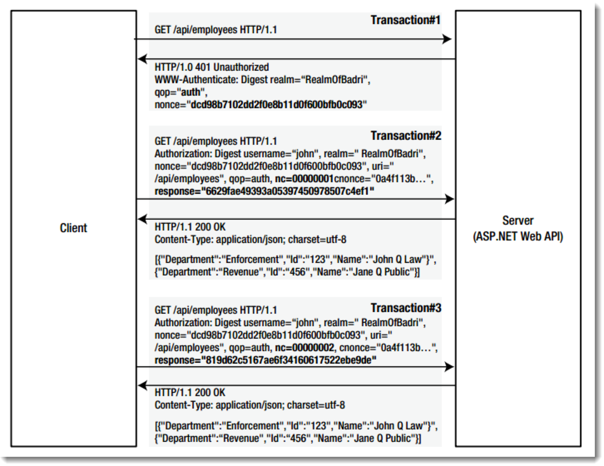
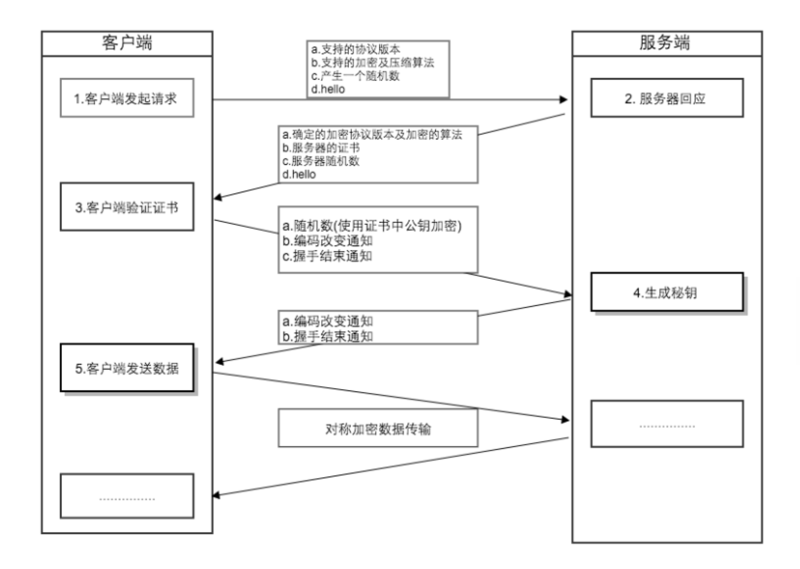

HTTP安全

* 基本认证机制
* digest认证
* HTTPS

---

基本认证原理

Note:

realm是RFC 2617里规定的,
同一个realm里用户的用户名/密码是相同的

---

digest认证

Note:

客户端请求 /api/employees；

服务端返回401未验证的状态，并且在返回的信息中包含了验证方式Digest，realm的值，QOP(quality of protection)只设置成auth，nonce为一串随机值，在下面的请求中会一直使用到，当过了存活期后服务端将刷新生成一个新的nonce值；

客户端接受到请求返回后，将username:realm:password进行HASH运算，假设运算后的值为HA1。又将请求的路径/api/employees进行HASH运算，假设运算后的值为HA2。再将HA1:nonce:nc:cnonce:qop:HA2进行HASH运算，得到的值放在response中。这里的cnonce为客户端生成的nonce值，而nc用于统计，假设开始时为00000001，下次请求后就变成了00000002，不一定每次都加1，但是后面请求中的nc值肯定大于前一次请求中的nc值。

服务端收到请求后将验证nonce是否过期，如果过期，那么直接返回401，即第二步的状态。如果没有过期，那么比较nc值，如果比前一次nc值小或者前一次根本没有存储的nc值，那么也将直接返回401状态。如果前面的验证都通过，那么服务端也将按照步骤3中计算最终HASH值的步骤计算出HASH值与客户端的进行比较，然后比较客户端提交过来的HASH值与服务端计算出来的HASH进行比较，不匹配返回401，匹配获取请求的数据并返回状态200。

---

HTTPS

HTTPS它是一个安全通信通道，它基于HTTP开发，用于在客户计算机和服务器之间交换信息。它使用安全套接字层(SSL)进行信息交换，简单来说它是HTTP的安全版,是使用 TLS/SSL 加密的 HTTP 协议。

<ul class="fragment current-visible" style="list-style: none; font-size: 14px;">
	<li>1994年，NetScape公司设计了SSL协议（Secure Sockets Layer）的1.0版，但是未发布。</li>
	<li>1995年，NetScape公司发布SSL 2.0版，很快发现有严重漏洞。</li>
	<li>1996年，SSL 3.0版问世，得到大规模应用。</li>
	<li>1999年，互联网标准化组织ISOC接替NetScape公司，发布了SSL的升级版TLS 1.0版。</li>
	<li>2006年和2008年，TLS进行了两次升级，分别为TLS 1.1版和TLS 1.2版。最新的变动是2011年TLS 1.2的修订版。</li>
</ul>

 <!-- .element: class="fragment" -->

Note:

ssl 3.0 是tsl1.0的基础, 有人也把tsl1.0叫做ssl 3.1

---

想要理解HTTPS, 需要理解几个概念:
* 对称加密算法
* 非对称加密算法
* CA(Certificate Authority)
* 数字证书
* 摘要/散列算法

Note:

提问: https是对称加密还是非对称加密

---

对称加密算法

常见算法DES, 3DES, AES

	
pros:

	<ul>
		<li>算法相对简单, 加密速度快</li>
	</ul>

	
cons:

	<ul>
		<li>
			
通信方式1对1, 大量密钥的管理与更新是个问题

			
		</li>
		<li>密钥的分发</li>
	</ul>

	公网环境下, 密钥如何的安全传输?

Note:

DES使用的密钥key为8字节, 把64位的明文转成64位的密文.
3DES使用的密钥为64字节
AES 是一个迭代的、对称密钥分组的密码，它可以使用128、192 和 256 位密钥.

---

非对称加密算法

常见算法RSA, ECC, DH

	
pros:

	<ul>
		<li>安全系数高</li>
		<li>通信方式1对多, server只需拥有一对公私钥就可以和n多客户端通信</li>
	</ul>

	
cons:

	<ul>
		<li>产生密钥麻烦</li>
		<li>加密速度慢</li>
	</ul>

	如何防止中间人攻击?

Note:

1977年 R。S、A三人提出。RSA算法是第一个同时用于加密和数字签名的算法。能抵抗大多数密码攻击，秘钥越长越难破解。

RSA目前1024位基本安全，2048位秘钥极其安全

算法基于： 将两个大质数相乘十分容易，但是想要对其乘积进行因式分解却极其困难。

---

CA(Certificate Authority)第三方

如何认证CA是可信任的?

如何防止证书被篡改?

Note:

普通证书产生的过程就是: 将个人提交的信息进行第三方具有权威性部门认证, 然后第三方权威部门确认个人信息合法无误后在自己的系统中登记.

1. 根证书, 其他CA机构可以向上一级的CA申请成为中间CA.
当B拿到A的数字证书之后, 会在证书的信息中找到A申请的CA, 而这个CA则会根据自己中间证书找到自己申请的CA, 就这样沿着证书链找证书, 假如某个中间证书或者根证书在本机安装有,则认为A的证书是可信任的.
这个就是证书链
2. CA给server的数字证书中有一个数字签名,  用私钥签名, 用公钥验证

二级证书结构存在的优势：
a.减少根证书结构的管理工作量，可以更高效的进行证书的审核与签发；

b.根证书一般内置在客户端中，私钥一般离线存储，一旦私钥泄露，则吊销过程非常困难，无法及时补救；

c.中间证书结构的私钥泄露，则可以快速在线吊销，并重新为用户签发新的证书；

d.证书链四级以内一般不会对HTTPS的性能造成明显影响。

---

摘要/散列算法

常用算法MD5, MD5-sess, SHA1

Note:

在数字签名时为防止server个人信息过大, 加密过程比较缓慢, 一般会用到摘要算法

---

HTTPS通讯过程

+++

HTTPS 性能损耗
- 加密/解密的过程是需要消耗时间 <!-- .element: class="fragment" -->
- 交换公钥/私钥消耗时间 <!-- .element: class="fragment" -->
- 跳转消耗时间 <!-- .element: class="fragment" -->

Note:

毕竟需要对传输的数据进行加密/解密，算法耗时是肯定有的。

https传输在传输之前是需要再服务端与客户端交换公钥/私钥的，这个过程也是非常耗时的。有统计称https的链接耗时是http的连接耗时的3倍。

这里还有一个影响速度的点，那就是用户在浏览器中输入网址的时候，是不会去自己输入https协议头的，如果我们想要用户访问https的网站的话，就要自己进行一次网页重定向，重定向也是比较耗时的操作。这都会对我们的网站速度造成影响。

+++

证书的价格
	* 有便宜的证书$10元一年

---

生成自签名的ssl Certificate

1. 生成Root CA的私钥, 用私钥签名生成CA证书
2. 生成server私钥和证书

---
Thank You
